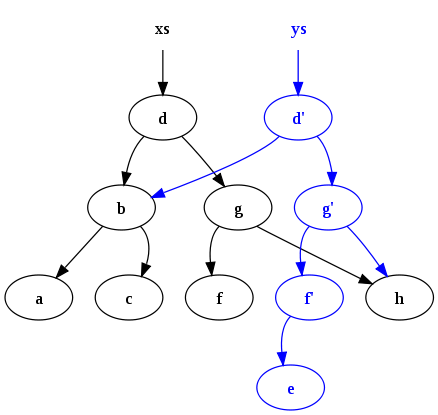

% La programmation fonctionnelle en JS
% David Sferruzza

# À propos de moi

- [\@d_sferruzza](https://twitter.com/d\_sferruzza)
- [github.com/dsferruzza](https://github.com/dsferruzza)
- développeur et responsable R&D chez [Escale](http://www.escaledigitale.com)
- doctorant en génie logiciel à l'Université de Nantes
- écrit des projets perso et pro en Scala et en Haskell (notamment) depuis ~ 2 an
- cette présentation est inspirée d'un article que j'ai écrit pour [24 jours de web](http://www.24joursdeweb.fr/2014/un-peu-de-programmation-fonctionnelle-en-javascript)


# Qu'est-ce que la programmation fonctionnelle ?


# Repères

Camembert > Programmation fonctionnelle


<figure></figure>


# FP is for Functional Programming

> [C'est] un **paradigme** de programmation qui considère le calcul en tant qu'**évaluation** de fonctions mathématiques.

> It is a **declarative** programming paradigm, which means programming is done with **expressions**.

<small>Sources : [Wikipedia FR](https://fr.wikipedia.org/wiki/Programmation_fonctionnelle) / [Wikipedia EN](https://en.wikipedia.org/wiki/Functional_programming)</small>


# Lambda calcul (λ calculus)

- Alonzo Church (1930s)
- système formel équivalent à la machine de Turing


<small>Slides sympa : [The Lambda Calculus and The JavaScript](http://fr.slideshare.net/normanrichards/the-lambda-calculus-and-the-javascript)</small>


# Pourquoi apprendre FP ?

- prendre du recul sur la programmation
- agrandir **et** consolider sa zone de confort
- réutiliser les concepts intéressants pour faire de **meilleurs programmes**

> Apprendre Haskell permet d'écrire de meilleurs programmes, même dans d'autres langages.


# Concepts

Aujourd'hui on va explorer des concepts vraiment cools issus de la programmation fonctionnelle moderne :

- transparence référentielle
- fonctions d’ordre supérieur
- évaluation paresseuse
- immuabilité

et les appliquer en JS !


# Fonction impure

```javascript
function diviserParDeux(nombre) {
	var missile = lancerUnMissileNucleaire();
	fairePorterLeChapeauAuDrManhattan(missile);
	return nombre / 2;
}
```

Cette fonction a des **effets de bord** *observables* qu'on ne peut pas deviner en regardant sa valeur de retour.
Il faut donc faire constamment attention lorsqu'on la manipule !

<figure></figure>


# Fonction pure

```javascript
function ajouterCinq(nombre) {
	return nombre + 5;
}
```

Cette fonction n'a pas d'effets de bord. Elle renvoie **toujours** le même résultat lorsqu'on l'appelle avec les mêmes arguments.

```javascript
ajouterCinq(-4) === ajouterCinq(-4)
```

<figure></figure>


# Transparence référentielle

> Le résultat du programme ne change pas si on remplace une expression par une expression de valeur équivalente.

Utiliser des fonctions pures permet de **raisonner** sur son programme comme sur une équation.

<figure></figure>


# Recommandations

## Construire son programme avec un maximum de fonctions pures

La logique métier est fiable, sans surprise et aisément testable.

## Isoler les fonctions qui ont des effets de bord

On sait quelles fonctions ont des effets de bord, ce qui permet d’être prudent lorsqu’on les manipule.


# Concepts

- ~~transparence référentielle~~
- fonctions d’ordre supérieur
- évaluation paresseuse
- immuabilité


# Fonction d'ordre supérieur

En JS, les fonctions sont des objets de première classe (*first-class citizen*).

Une fonction d’ordre supérieur est une fonction qui possède au moins l'une des propriétés suivantes :

- elle accepte au moins une autre fonction en paramètre
- elle retourne une fonction en résultat

<figure></figure>


# Exemple de fonction d'ordre supérieur

```javascript
function appliquerDeuxFois(f, x) {
	return f(f(x));
}
// ^ accepte une fonction en paramètre

function foisTrois(x) {
	return x * 3;
}

appliquerDeuxFois(foisTrois, 7);
// --> (7 * 3) * 3 = 63
```


# Intérêt des fonctions d'ordre supérieur

- bien séparer les différentes tâches effectuées par nos fonctions
- écrire des fonctions composables, modulables, paramétrables

<figure></figure>


# Exemple !!

On va voir un exemple concret : les opérations sur les tableaux en JS.


# Situation

```javascript
var villes = [
	{ nom: "Nantes", dep: 44, mer: false },
	{ nom: "Dunkerque", dep: 59, mer: true },
	{ nom: "Paris", dep: 75, mer: false },
];
```

On veut obtenir une liste de chaines de type `ville (dep)`.

On va écrire une fonction `rendreVillesAffichables` telle que :

```javascript
rendreVillesAffichables(villes);
// --> ["Nantes (44)", "Dunkerque (59)",
//      "Paris (75)"]
```


# Solution impérative

```javascript
function rendreVillesAffichables(villes) {
	for (var i = 0; i < villes.length; i++) {
		villes[i] = villes[i].nom +
					" (" + villes[i].dep + ")";
	}
	return villes;
}
```

On mélange 2 comportements :

- parcourir le tableau
- transformer les données


# Array.map

```javascript
function rendreVillesAffichables(villes) {
	function transformation(ville) {
		return ville.nom +
				" (" + ville.dep + ")";
	}
	return villes.map(transformation);
}
```

- `Array.map` gère le parcours du tableau \\o/
- on gère la transformation


# Syntaxe ES6

Avec les *lambdas* et les *template strings* c'est encore plus clair !

```javascript
villes.map(v => `${v.nom} (${v.dep})`);
// --> ["Nantes (44)", "Dunkerque (59)",
//      "Paris (75)"]
```


# Array.filter

```javascript
villes.filter(function(item) {
	// Si la ville est près de la mer,
	// on renvoie true, sinon false
	return item.mer;
});
// --> [ { nom: "Dunkerque", dep: 59,
//			mer: true }
```


# Chainons !

```javascript
villes.filter(function(item) {
	return !item.mer;
}).map(function(item) {
	return item.nom + " (" + item.dep + ")";
});
// --> ["Nantes (44)", "Paris (75)"]
```

*Rappel : `Array.map` et `Array.filter` sont des fonctions d'ordre supérieur.*


# Array.reduce

```javascript
var personnes = [
	{ nom: "Bruce", age: 30 },
	{ nom: "Tony", age: 35 },
	{ nom: "Peter", age: 26 },
];

personnes.reduce(function(acc, cur) {
	return acc + cur.age;
}, 0);
// --> 91
```


# Array.reduce

```javascript
function map(tableau, transformation) {
	return tableau.reduce(function(acc, cur) {
		acc.push(transformation(cur));
		return acc;
	}, []);
}

function filter(tableau, predicat) {
	return tableau.reduce(function(acc, cur) {
		if (predicat(cur)) acc.push(cur);
		return acc;
	}, []);
}
```


# Recommandations

Éviter d'utiliser des boucles pour manipuler des tableaux.

## Antisèche

Si vous avez un tableau et que vous voulez :

- appliquer une transformation sur chacune de ses cases (en conservant leur ordre/nombre) : **map**
- supprimer certaines cases (en conservant l’ordre et le contenu des autres) : **filter**
- le parcourir pour construire une nouvelle structure de données : **reduce**


# Concepts

- ~~transparence référentielle~~
- ~~fonctions d’ordre supérieur~~
- évaluation paresseuse
- immuabilité


# Stratégie d'évaluation

- **quand** évaluer les arguments d'un appel de fonction
- **quel type de valeur** passer à la fonction

<figure></figure>


# Évaluation stricte

*strict evaluation, eager evaluation, greedy evaluation*

- **quand :** dès que l'expression peut être liée à une variable
- **quel type de valeurs :**
	- *call by value*
	- *call by reference*
	- *call by sharing*
	- ...


# Évaluation non stricte

*non-strict evaluation, lazy evaluation*

- **call by name :** les arguments sont substitués dans le corps de la fonction
- **call by need :** idem, avec *mémoïsation* (≈ mise en cache du résultat de l'évaluation des arguments)
- ...


# Évaluation paresseuse

L'exécution d'un bout de code ne se fait pas avant que les résultats de ce bout de code ne soient réellement nécessaires.

<figure></figure>


# À quoi ça sert ?

- **optimisation :** on peut éviter des calculs inutiles
- **maintenabilité :**
	- on peut exprimer des structures de données infinies
	- on peut définir des structures de contrôle comme des abstractions, au lieu de primitives


# Lo-Dash

> A JavaScript utility library delivering consistency, modularity, performance, & extras.

<https://lodash.com/>

- bibliothèque JS qui permet (notamment) de manipuler les collections
- *lazy* depuis la v3


# Exemple

```javascript
var t = [0, 1, 2, 3, 4];

function plusUn(nb) {
	console.log(nb + ' + 1');
	if (nb > 2) console.log('Traitement long');
	return nb + 1;
}

function petit(nb) {
	console.log(nb + ' plus petit que 3 ?');
	return nb < 3;
}
```


# Sans Lo-Dash

<div style="float: right; margin-right: 100px;">
```javascript
var js = t
		.map(plusUn)
		.filter(petit)
		.slice(0, 2);
```
</div>

```
0 + 1
1 + 1
2 + 1
3 + 1
Traitement long
4 + 1
Traitement long
1 plus petit que 3 ?
2 plus petit que 3 ?
3 plus petit que 3 ?
4 plus petit que 3 ?
5 plus petit que 3 ?
[ 1, 2 ]
```


# Sans Lo-Dash

<figure></figure>


# Avec Lo-Dash

```javascript
var _ = require('lodash');
var lodash = _(t)
		.map(plusUn)
		.filter(petit)
		.take(2)
		.value();
```

```
0 + 1
1 plus petit que 3 ?
1 + 1
2 plus petit que 3 ?
[ 1, 2 ]
```


# Avec Lo-Dash

<figure></figure>


# Évaluation paresseuse

- séparation
	- du Calcul, de la **génération**<br>*→ où le calcul d'une valeur est-il défini ?*
	- du Contrôle, de la **condition d'arrêt**<br>*→ où le calcul d'une valeur se produit-il ?*
- *colle* qui permet d'assembler efficacement des (bouts de) programmes : facilite l'approche *diviser pour régner*

**Avantages :** peut augmenter la maintenabilité *et* les performances

**Inconvénients :** peut introduire de l'*overhead* (dépend pas mal de la techno)


# Concepts

- ~~transparence référentielle~~
- ~~fonctions d’ordre supérieur~~
- ~~évaluation paresseuse~~
- immuabilité


# Immuabilité

> Un objet immuable est un objet dont l'état ne peut pas être modifié après sa création.


# Immuables en JS

- booléens
- nombres
- chaines

```javascript
var n = 10;
n = 10 + 1;
```

On a juste changé la référence (`n`), pas les données (`10`)

`10 + 1` ne modifie ni `10` ni `1`


# Pas immuables en JS

- objets
- (et donc) tableaux

```javascript
var objet = {
	a: 1,
	b: 'BATMAN',
};
var alias = objet;

objet.a = 2;
objet // { a: 2, b: 'BATMAN' }
alias // { a: 2, b: 'BATMAN' }
```


# const != immutable

```javascript
const objet = {
	a: 1,
	b: 'BATMAN',
};
const alias = objet;

objet.a = 2;
objet // { a: 2, b: 'BATMAN' }
alias // { a: 2, b: 'BATMAN' }
```

`const` empêche de modifier la **référence**, pas la valeur !

*`const` c'est top quand même ;)*


# Immutable.js

> Immutable persistent data collections for Javascript which increase efficiency and simplicity.

<https://facebook.github.io/immutable-js/>

- une bibliothèque qui propose une API de collections immuables
- List, Stack, [Ordered]Map, [Ordered]Set, Record, ...


# Immutable.js

```javascript
var Immutable = require('immutable');

var map1 = Immutable.Map({a:1, b:2, c:3});
var map2 = map1.set('b', 50);
map1.get('b'); // 2
map2.get('b'); // 50

var map3 = map2.set('b', 2);
map1.equals(map3); // --> true
```

*Attention : ne pas confondre `Map` (structure de données) et `map` (fonction) !*


# Avantages

- lisibilité/maintenabilité : 1 référence pour 1 valeur
- pas d'effets de bord
- *thread safe*

Et les perfs ?


# Performances

Introduit de l'*overhead*, mais souvent le compromis maintenabilité/performances est bon




# Recommandations

## Utiliser `const`

Et `let` le reste du temps.
Pas `var`.

## Éviter la mutabilité dans les APIs qu'on crée/manipule

Une méthode qui modifie un objet devrait renvoyer un nouvel objet, pas le modifier en cachette.

```javascript
const tableau = [1, 2, 3];
tableau.push(4);
//       ^ beurk un effet de bord
```


# Concepts

- ~~transparence référentielle~~
- ~~fonctions d’ordre supérieur~~
- ~~évaluation paresseuse~~
- ~~immuabilité~~

<figure></figure>


# Ressources

- [Learn You A Haskell For Great Good](http://learnyouahaskell.com/) : livre très accessible pour débuter Haskell ([traduction FR non officielle](http://lyah.haskell.fr/))
- [JavaScript Alongé](https://leanpub.com/javascript-allonge) : un livre avancé sur JavaScript ; il explique et met en place certains concepts vus ici
- [Why Functional Programming Matters](http://www.cs.kent.ac.uk/people/staff/dat/miranda/whyfp90.pdf) : pourquoi les fonctions d'ordre supérieur et l'évaluation paresseuse sont parmi les meilleurs outils pour écrire des programmes modulaires


# Ressources

- [John Hughes on Why Functional Programming Matters!](http://www.infoq.com/interviews/john-hughes-fp)
- [Is your programming language unreasonable?](http://fsharpforfunandprofit.com/posts/is-your-language-unreasonable/) *or, why predictability is important*
- [tcomb.js](https://gcanti.github.io/tcomb/) : *Domain Driven Design* et vérification de types pour JavaScript


# Questions ?


Twitter : [\@d_sferruzza](https://twitter.com/d\_sferruzza)

Slides sur GitHub :

[dsferruzza/conf-programmation-fonctionnelle-en-js](http://github.com/dsferruzza/conf-programmation-fonctionnelle-en-js)
